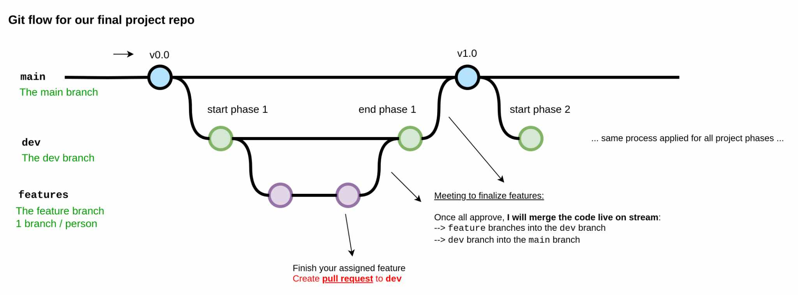

# [Group 1 - Lotus] Final Lab Report: A Study of Remote Work and Its Effects on Employees’ Mental Well-Being

## Introduction
In this project, we investigates the [Remote Work & Mental Health Dataset on Kaggle](https://www.kaggle.com/datasets/waqi786/remote-work-and-mental-health?fbclid=IwY2xjawFrSKZleHRuA2FlbQIxMAABHeONLRrPuU1AbC_pHea8QyWNYYMqW-t0Tw_xZtxvDGbldU1ypWS0-AzKKg_aem_jAr-PidmQqlOTGowulNZBA) to uncover patterns and trends in remote work conditions.

Our primary objective is to examine how working conditions impact employees' mental well-being and provide actionable, data-driven insights for organizations to enhance their work arrangement strategies.

## Contributors

Group information and task distribution

| Student ID |    Full name    |       Tasks       |
|------------|-----------------|-------------------|
|  22120177  |  Van Tuan Kiet  | **Section 1.2** (License), **Section 3.1** (question number 1); Reviewing tasks, hosting Github repository |
|  22120322  | Tong Trong Tam  | **Section 1.3** (Collection methods), **Section 2** (Data Exploration), **Section 3.3** (Question number 3) |
|  22120457  |  Khuu Hai Chau  | **Section 1.1** (Dataset overview), **Section 3.2** (question number 2); Refining code structure, solving lexical issues |

## Project phases
**Phase 1: Data Collection**
- Gather, import and clean the dataset.
- Develop meaningful and impactful questions to address.

**Phase 2: Data Exploration**
- Perform exploratory data analysis to identify patterns.
- Visualize data using different types of plot.

**Phase 3: Conclusion**
- Address the proposed questions.
- Summarize findings and provide recommendations.

## Meeting history
- **21/11/2024**
  * Discuss about choosen dataset, tasks and brainstorm idea to solve them as well
  * Distribute tasks for phase 1
  * Push initial commit to Github repository (including dataset, README.md, and notebook file with phase 1's task assignments)
- **01/12/2024**
  * Wrap all of phase 1's tasks up 
  * Merge (resolve conflict, if any ) pull reuqests related to phase 1
  * Genrally discuss phase 2 and brainstorm idea to adress them
- **11/12/2024**
  * Wrap all of phase 2's tasks up 
  * Merge (resolve conflict, if any) pull reuqests related to phase 2
  * Genrally discuss phase 3 and brainstorm idea to adress them
- **13/12/2024**
  * Merge (resolve conflict, if any ) pull reuqests related to phase 3
  * Discuss about refining anything needed with the aim for well-structured notebook file 🌷
- **15/12/2024**
  * Wrap up all tasks and prepare for presenting!

## Github flow
This is the first time we have drawn git flow. We kindly want to know if you have any suggestions to us ❤️

## References
[1] Pandas documentation

[2] Matplotlib documentation

[3] data uncollected, [*Asking good questions to data*](https://www.linkedin.com/pulse/asking-good-questions-data-meenakshi-meena-das/)
